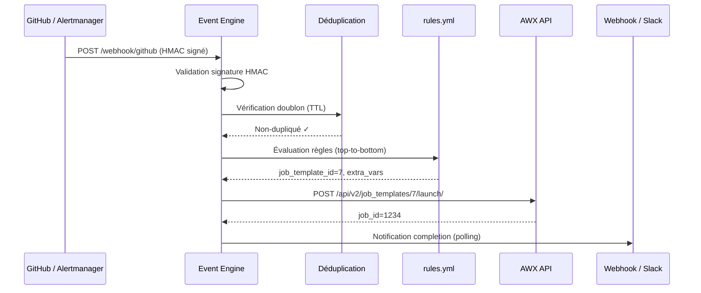

# Event Engine

L'Event Engine est le routeur d'événements d'Autoflow. Il reçoit des webhooks de sources diverses (GitHub, Gitea, Alertmanager, systèmes internes), les fait correspondre à des règles YAML, et déclenche les Job Templates AWX appropriés.

---

## Architecture



---

## Sources supportées

| Source | Endpoint | Validation |
|---|---|---|
| `github` | `POST /webhook/github` | HMAC SHA-256 (`X-Hub-Signature-256`) |
| `gitea` | `POST /webhook/gitea` | HMAC SHA-256 (header Gitea) |
| `alertmanager` | `POST /webhook/alertmanager` | Aucune (réseau interne) |
| `generic` | `POST /event` | Bearer token optionnel |
| `scheduler` | Interne (cron) | N/A |

---

## Validation HMAC

### GitHub

Chaque webhook GitHub peut être signé avec un secret HMAC. L'Event Engine valide le header `X-Hub-Signature-256` :

```bash
# .env
GITHUB_WEBHOOK_SECRET=mon-secret-github-tres-long
```

Dans GitHub → Settings → Webhooks → votre webhook :
- **Payload URL** : `https://events.DOMAIN/webhook/github`
- **Content type** : `application/json`
- **Secret** : valeur de `GITHUB_WEBHOOK_SECRET`

### Gitea

```bash
# .env
GITEA_WEBHOOK_SECRET=mon-secret-gitea
```

Dans Gitea → dépôt → Settings → Webhooks :
- **Target URL** : `https://events.DOMAIN/webhook/gitea`
- **Secret** : valeur de `GITEA_WEBHOOK_SECRET`
- **Trigger** : selon les besoins (push, release, etc.)

!!! tip "Secret vide = validation désactivée"
    Laisser `GITHUB_WEBHOOK_SECRET` ou `GITEA_WEBHOOK_SECRET` vide désactive la validation HMAC. Acceptable en réseau interne isolé, déconseillé si l'Event Engine est exposé à internet.

---

## Structure de `rules.yml`

Le fichier `event-engine/rules.yml` définit les règles de routage. Les règles sont évaluées **de haut en bas** — la **première correspondance** gagne.

```yaml
rules:
  - name: "Nom lisible (pour les logs)"
    match:
      source: "github"           # Correspondance exacte sur event.source
      action: "push"             # Correspondance exacte sur event.action
      ref: "refs/heads/main"    # N'importe quel champ de event.data (chemin pointé)
    job_template_id: 7           # ID du Job Template AWX
    extra_vars:                  # Variables statiques injectées dans AWX
      environment: "production"
    extra_vars_from_data:        # Variables extraites dynamiquement de event.data
      git_commit: "head_commit.id"
      git_author: "head_commit.author"
```

### Champs de `match`

| Champ | Type | Description |
|---|---|---|
| `source` | string | Source de l'événement (`github`, `alertmanager`, etc.) |
| `action` | string | Action (`push`, `firing`, `deploy`, etc.) — supporte le suffixe `*` |
| `<dotted.path>` | any | N'importe quel champ extrait de `event.data` par notation pointée |

!!! info "Logique AND"
    Tous les critères du bloc `match` doivent être vrais simultanément (logique AND). Il n'y a pas de logique OR native — créez une règle distincte pour chaque variante.

### `extra_vars_from_data`

Permet d'extraire des champs du payload webhook pour les passer comme variables AWX :

```yaml
extra_vars_from_data:
  awx_variable_name: "chemin.pointe.dans.data"
```

Exemple : pour un webhook GitHub push, `head_commit.id` extrait le SHA du commit et l'injecte dans AWX comme `{{ git_commit }}`.

---

## Règles par défaut incluses

Le fichier `event-engine/rules.yml` inclut ces règles prêtes à l'emploi :

=== "GitHub Push"
    ```yaml
    # Push sur main → déploiement production
    - name: "GitHub push to main → deploy prod"
      match:
        source: "github"
        action: "push"
        ref:    "refs/heads/main"
      job_template_id: 7
      extra_vars:
        environment: "production"
      extra_vars_from_data:
        git_repo:   "repository.full_name"
        git_commit: "head_commit.id"
        git_author: "head_commit.author"

    # Push sur develop → déploiement staging
    - name: "GitHub push to develop → deploy staging"
      match:
        source: "github"
        action: "push"
        ref:    "refs/heads/develop"
      job_template_id: 8
      extra_vars:
        environment: "staging"
    ```

=== "GitHub Release"
    ```yaml
    - name: "GitHub release published → production release"
      match:
        source: "github"
        action: "published"
      job_template_id: 7
      extra_vars:
        environment: "production"
        is_release:  "true"
      extra_vars_from_data:
        release_tag:  "release.tag_name"
        release_name: "release.name"
        git_repo:     "repository.full_name"
    ```

=== "Alertmanager"
    ```yaml
    # Alerte critique → remédiation automatique
    - name: "Critical alert firing → remediation playbook"
      match:
        source:   "alertmanager"
        action:   "firing"
        severity: "critical"
      job_template_id: 10
      extra_vars:
        trigger: "alert"
      extra_vars_from_data:
        alert_name:    "alertname"
        alert_summary: "summary"

    # Alerte warning → notification seulement
    - name: "Warning alert firing → notification job"
      match:
        source:   "alertmanager"
        action:   "firing"
        severity: "warning"
      job_template_id: 11
    ```

### Règle de fallback

Si **aucune règle** ne correspond, l'événement est envoyé au template défini par `AWX_JOB_TEMPLATE_ID` dans `.env` :

```bash
# .env
AWX_JOB_TEMPLATE_ID=1   # Template de fallback
```

---

## Recharger les règles sans redémarrage

```bash
# Hot-reload des règles (nécessite EVENT_ENGINE_ADMIN_TOKEN)
curl -X POST https://events.DOMAIN/admin/rules/reload \
  -H "Authorization: Bearer ${EVENT_ENGINE_ADMIN_TOKEN}"

# Vérifier les règles chargées
curl -s https://events.DOMAIN/admin/rules \
  -H "Authorization: Bearer ${EVENT_ENGINE_ADMIN_TOKEN}" \
  | python3 -m json.tool
```

---

## Schedules — `schedules.yml`

Le fichier `event-engine/schedules.yml` permet de déclencher des événements sur un **planning cron** (UTC). Les événements planifiés passent par le même moteur de règles que les webhooks.

```yaml
schedules:
  - name: daily-health-check          # Identifiant unique (requis)
    cron: "0 6 * * *"                 # Cron UTC standard (5 champs)
    source: scheduler                  # Source de l'événement synthétique
    action: health-check              # Action de l'événement
    data:                             # Données passées en extra_vars
      environment: production
      check_type: full
```

### Schedules inclus

| Nom | Cron (UTC) | Source | Action |
|---|---|---|---|
| `daily-health-check` | `0 6 * * *` | `scheduler` | `health-check` |
| `weekly-compliance-scan` | `0 2 * * 0` | `scheduler` | `compliance-scan` |
| `cert-expiry-check` | `*/15 * * * *` | `scheduler` | `cert-check` |
| `nightly-backup` | `30 3 * * *` | `scheduler` | `backup` |

### Hot-reload des schedules

```bash
curl -X POST https://events.DOMAIN/admin/schedules/reload \
  -H "Authorization: Bearer ${EVENT_ENGINE_ADMIN_TOKEN}"
```

---

## Déduplication

L'Event Engine déduplique les événements identiques reçus dans une fenêtre temporelle pour éviter de lancer le même job plusieurs fois en cas de retry webhooks :

```bash
# .env
DEDUP_TTL=60   # Fenêtre de déduplication en secondes (0 = désactivé)
```

La clé de déduplication est calculée à partir de `source`, `action` et d'un hash du payload. Deux événements identiques dans la fenêtre `DEDUP_TTL` ne lancent qu'un seul job AWX.

```bash
# Voir les stats de déduplication
curl -s https://events.DOMAIN/admin/dedup/stats \
  -H "Authorization: Bearer ${EVENT_ENGINE_ADMIN_TOKEN}"

# Vider le cache de déduplication
curl -X POST https://events.DOMAIN/admin/dedup/clear \
  -H "Authorization: Bearer ${EVENT_ENGINE_ADMIN_TOKEN}"
```

---

## Notifications de fin de job

L'Event Engine surveille les jobs AWX lancés et envoie des notifications à leur complétion :

```bash
# .env
NOTIFICATION_WEBHOOK_URL=https://hooks.example.com/autoflow
NOTIFICATION_SLACK_WEBHOOK=https://hooks.slack.com/services/T.../B.../xxx
JOB_WATCHER_INTERVAL=15   # Polling AWX toutes les 15 secondes
```

### Payload webhook générique

```json
{
  "job_id": 1234,
  "status": "successful",
  "job_template": "Deploy Production",
  "duration_seconds": 42,
  "started": "2025-01-15T10:00:00Z",
  "finished": "2025-01-15T10:00:42Z"
}
```

### Message Slack (Block Kit)

Le message Slack inclut le nom du template, le statut (avec emoji), la durée et un lien direct vers le job dans AWX.

---

## Token admin — `EVENT_ENGINE_ADMIN_TOKEN`

Les endpoints `/admin/*` sont protégés par un Bearer token :

```bash
# .env
EVENT_ENGINE_ADMIN_TOKEN=mon-token-admin-securise

# Utilisation
curl -H "Authorization: Bearer ${EVENT_ENGINE_ADMIN_TOKEN}" \
  https://events.DOMAIN/admin/rules
```

!!! danger "Token vide = endpoints bloqués"
    Si `EVENT_ENGINE_ADMIN_TOKEN` est vide (défaut), tous les endpoints `/admin/*` retournent `403 Forbidden`. C'est le comportement sécurisé par défaut — définissez le token pour activer l'administration à distance.

---

## File d'attente et Dead-Letter Queue

Avec Redis configuré, l'Event Engine persiste les événements et gère les retries automatiques :

| Queue | Description |
|---|---|
| Pending | Événements en attente de traitement |
| Retry | Événements en cours de réessai (backoff exponentiel : 30s → 2min → 5min → 10min → 20min) |
| DLQ | Événements après 5 échecs (Dead-Letter Queue) |

```bash
# Stats des queues
curl -s https://events.DOMAIN/admin/queue/stats \
  -H "Authorization: Bearer ${EVENT_ENGINE_ADMIN_TOKEN}"

# Voir la DLQ
curl -s https://events.DOMAIN/admin/dlq \
  -H "Authorization: Bearer ${EVENT_ENGINE_ADMIN_TOKEN}"

# Ré-envoyer un événement de la DLQ
curl -X POST https://events.DOMAIN/admin/dlq/{event_id}/requeue \
  -H "Authorization: Bearer ${EVENT_ENGINE_ADMIN_TOKEN}"
```

---

## Endpoints disponibles

| Méthode | Endpoint | Description |
|---|---|---|
| `GET` | `/health` | Liveness probe |
| `POST` | `/event` | Événement générique canonique |
| `POST` | `/webhook/github` | Webhook GitHub (HMAC validé) |
| `POST` | `/webhook/alertmanager` | Webhook Alertmanager |
| `GET` | `/metrics` | Métriques Prometheus |
| `GET` | `/admin/rules` | Règles chargées |
| `POST` | `/admin/rules/reload` | Hot-reload rules.yml |
| `GET` | `/admin/schedules` | Schedules chargés |
| `POST` | `/admin/schedules/reload` | Hot-reload schedules.yml |
| `GET` | `/admin/dedup/stats` | Stats déduplication |
| `POST` | `/admin/dedup/clear` | Vider le cache dédup |
| `GET` | `/admin/queue/stats` | Stats des queues |
| `GET` | `/admin/dlq` | Contenu DLQ |
| `POST` | `/admin/dlq/{id}/requeue` | Ré-envoyer un événement |
| `DELETE` | `/admin/dlq` | Vider la DLQ |

---

## Variables d'environnement — Référence

| Variable | Défaut | Description |
|---|---|---|
| `AWX_TOKEN` | — | Token API AWX (scope Write) |
| `AWX_JOB_TEMPLATE_ID` | `1` | Template de fallback |
| `EVENT_ENGINE_ADMIN_TOKEN` | `""` | Bearer token pour /admin/* |
| `GITHUB_WEBHOOK_SECRET` | `""` | Secret HMAC GitHub |
| `GITEA_WEBHOOK_SECRET` | `""` | Secret HMAC Gitea |
| `DEDUP_TTL` | `60` | Fenêtre déduplication (secondes) |
| `NOTIFICATION_WEBHOOK_URL` | `""` | Webhook de notification |
| `NOTIFICATION_SLACK_WEBHOOK` | `""` | Slack incoming webhook |
| `JOB_WATCHER_INTERVAL` | `15` | Polling AWX (secondes) |

---

## Exemple complet — Ajouter une règle

**Objectif :** déclencher un job de déploiement sur tag Git.

1. Editez `event-engine/rules.yml` :

```yaml
- name: "Git tag push → deploy versioned release"
  match:
    source: "gitea"
    action: "push"
    ref:    "refs/tags/*"   # Wildcard sur les tags
  job_template_id: 15
  extra_vars:
    deployment_type: "release"
  extra_vars_from_data:
    tag_name:  "ref"
    repo_name: "repository.full_name"
    pusher:    "pusher.login"
```

2. Rechargez sans redémarrage :

```bash
curl -X POST https://events.DOMAIN/admin/rules/reload \
  -H "Authorization: Bearer ${EVENT_ENGINE_ADMIN_TOKEN}"
```

3. Vérifiez que la règle est bien chargée :

```bash
curl -s https://events.DOMAIN/admin/rules \
  -H "Authorization: Bearer ${EVENT_ENGINE_ADMIN_TOKEN}" \
  | python3 -m json.tool
```
