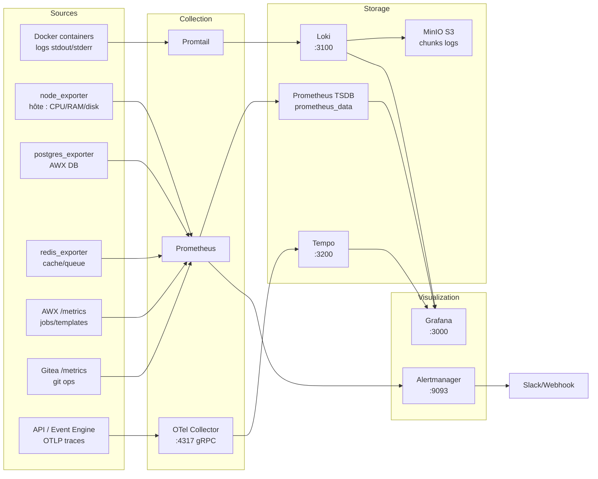

# Monitoring

Autoflow embarque la stack **LGTM** complète : Loki (logs), Grafana (visualisation), Tempo (traces), et Prometheus/Alertmanager (métriques + alertes). Tout est préconfigurée — datasources, dashboards et règles d'alerte sont provisionnés automatiquement.

---

## Architecture de la stack



---

## Prometheus

### Configuration

Fichier : `monitoring/prometheus/prometheus.yml`

Prometheus scrape les targets suivantes :

| Job | Target | Interval | Notes |
|---|---|---|---|
| `node` | `node_exporter:9100` | 15s | CPU, RAM, disque, réseau hôte |
| `postgres` | `postgres_exporter:9187` | 30s | Métriques AWX DB |
| `redis` | `redis_exporter:9121` | 15s | Cache/queue AWX |
| `awx` | `api:8000/metrics` | 60s | Jobs AWX, templates, inventaires |
| `gitea` | `gitea:3001/metrics` | 30s | Bearer token `GITEA_METRICS_TOKEN` |
| `alertmanager` | `alertmanager:9093` | 30s | Métriques Alertmanager |

### Variables d'environnement

| Variable | Description |
|---|---|
| `PROMETHEUS_RETENTION` | Rétention TSDB (ex: `15d`, `30d`, `90d`) |
| `PROMETHEUS_PORT` | Port interne (défaut: `9090`) |
| `MONITORING_ADMIN_USER` | Username BasicAuth Traefik |
| `MONITORING_ADMIN_PASSWORD` | Password BasicAuth (auto-haché) |

### Accès

URL : `https://prometheus.<DOMAIN>` — protégé par BasicAuth Traefik.

```bash
# Tester depuis le serveur
curl -u "$MONITORING_ADMIN_USER:$MONITORING_ADMIN_PASSWORD" \
  https://prometheus.<DOMAIN>/api/v1/query?query=up
```

---

## Grafana

### Datasources préconfigurées

Provisionnées automatiquement depuis `monitoring/grafana/provisioning/datasources/` :

| Datasource | URL interne | Usage |
|---|---|---|
| Prometheus | `http://prometheus:9090` | Métriques |
| Loki | `http://loki:3100` | Logs |
| Tempo | `http://tempo:3200` | Traces distribuées |

### Dashboards inclus

| Dashboard | Contenu |
|---|---|
| **Autoflow Overview** | Vue d'ensemble : jobs AWX, services up/down, dernières alertes |
| **AWX Jobs** | Jobs en cours, taux de réussite/échec, durée par template |
| **Système Hôte** | CPU, RAM, disque, réseau (depuis node_exporter) |
| **PostgreSQL** | Connexions, cache hit ratio, transactions/s, locks |
| **Redis** | Mémoire, commandes/s, evictions, clients |
| **Gitea** | Opérations git, webhooks, runners |
| **Certificats PKI** | Expiry des certificats, alertes renouvellement |

### Ajouter un dashboard

1. Créer le dashboard dans l'UI Grafana
2. Exporter en JSON : **Dashboard → Share → Export → Save to file**
3. Placer le fichier dans `monitoring/grafana/provisioning/dashboards/`
4. Redémarrer Grafana ou attendre le rechargement automatique (30s)

```bash
# Forcer le rechargement
docker compose restart grafana
```

---

## Loki — Agrégation de logs

### Configuration

Loki reçoit les logs de Promtail et les stocke dans MinIO (S3-compatible).

**Rétention :** contrôlée par `LOKI_RETENTION` (défaut : `720h` = 30 jours).  
Le compacteur supprime automatiquement les chunks MinIO au-delà de cette période.

### Requêtes LogQL essentielles

```logql
# Tous les logs d'un service
{container_name="autoflow_awx_web"}

# Logs d'erreur de toute la stack
{compose_project="autoflow"} |= "error" | json

# Logs AWX des jobs qui échouent
{container_name="autoflow_awx_task"} |= "failed" | json

# Logs Gitea avec webhook
{container_name="autoflow_gitea"} |= "webhook"

# Comptage d'erreurs par conteneur (5 dernières minutes)
sum by (container_name) (
  count_over_time({compose_project="autoflow"} |= "error" [5m])
)
```

### Promtail — Labels automatiques

Chaque ligne de log est enrichie avec :

| Label | Valeur | Source |
|---|---|---|
| `container_name` | `autoflow_awx_web` | Métadonnée Docker |
| `image` | `autoflow/awx-patched:24.6.1` | Métadonnée Docker |
| `compose_project` | `autoflow` | Label Docker Compose |
| `compose_service` | `awx_web` | Label Docker Compose |

---

## Tempo — Tracing distribué

### Services instrumentés

Les services FastAPI d'Autoflow envoient des traces OTLP via l'OTel Collector :

- `autoflow_api` (port 8000)
- `autoflow_event_engine` (port 8001)

Variable d'environnement : `OTEL_EXPORTER_OTLP_ENDPOINT=http://otel-collector:4317`

### Corrélation logs ↔ traces dans Grafana

Tempo est configuré comme datasource avec une corrélation Loki : cliquez sur un `trace_id` dans les logs pour ouvrir directement la trace correspondante dans Tempo.

---

## Alertmanager

### Configuration

Fichier : `monitoring/alertmanager/alertmanager.yml`

Exemple de configuration Slack :

```yaml
global:
  resolve_timeout: 5m

route:
  group_by: ['alertname', 'job']
  group_wait: 10s
  group_interval: 5m
  repeat_interval: 4h
  receiver: 'slack'
  routes:
    - match:
        severity: critical
      receiver: 'slack-critical'

receivers:
  - name: 'slack'
    slack_configs:
      - api_url: 'https://hooks.slack.com/services/XXX/YYY/ZZZ'
        channel: '#autoflow-alerts'
        send_resolved: true
        title: '[{{ .Status | toUpper }}] {{ .GroupLabels.alertname }}'
        text: '{{ range .Alerts }}{{ .Annotations.summary }}{{ end }}'

  - name: 'slack-critical'
    slack_configs:
      - api_url: 'https://hooks.slack.com/services/XXX/YYY/ZZZ'
        channel: '#autoflow-critical'
        send_resolved: true

inhibit_rules:
  - source_match:
      severity: 'critical'
    target_match:
      severity: 'warning'
    equal: ['alertname', 'job']
```

Appliquer la configuration :
```bash
docker compose restart alertmanager
```

### Règles d'alerte

Les règles sont dans `monitoring/prometheus/rules/`. Exemples inclus :

| Alerte | Condition | Sévérité |
|---|---|---|
| `ServiceDown` | Container arrêté > 2 min | critical |
| `HighMemoryUsage` | RAM hôte > 90% | warning |
| `DiskSpaceLow` | Disque < 10% libre | critical |
| `AWXJobFailRate` | Taux échec AWX > 20% | warning |
| `PostgresConnections` | Connexions PG > 80% du max | warning |
| `CertificateExpiry` | Certificat expire < 30 jours | warning |

### Ajouter une règle d'alerte

```yaml
# monitoring/prometheus/rules/custom.yml
groups:
  - name: custom
    rules:
      - alert: HighAWXJobFailure
        expr: |
          (
            rate(awx_jobs_total{status="failed"}[1h]) /
            rate(awx_jobs_total[1h])
          ) > 0.3
        for: 10m
        labels:
          severity: warning
        annotations:
          summary: "AWX job failure rate > 30% in last hour"
          description: "{{ $value | humanizePercentage }} of AWX jobs are failing"
```

```bash
# Valider la syntaxe
docker exec autoflow_prometheus promtool check rules /etc/prometheus/rules/custom.yml

# Recharger sans redémarrer
docker exec autoflow_prometheus kill -HUP 1
```

---

## MinIO — Backend Loki

MinIO stocke les chunks de logs Loki. Accès console : `https://grafana.<DOMAIN>/minio` (si exposé) ou directement sur le port interne.

| Bucket | Usage |
|---|---|
| `loki-chunks` | Chunks de logs compressés |

Le compte `loki` (lecture/écriture sur `loki-chunks` uniquement) est créé par `minio_init` au premier démarrage.

!!! warning "Espace disque"
    Surveiller l'utilisation du volume `minio_data`. En cas de saturation, Loki refuse les nouvelles ingestions.
    ```bash
    docker exec autoflow_minio df -h /data
    ```
