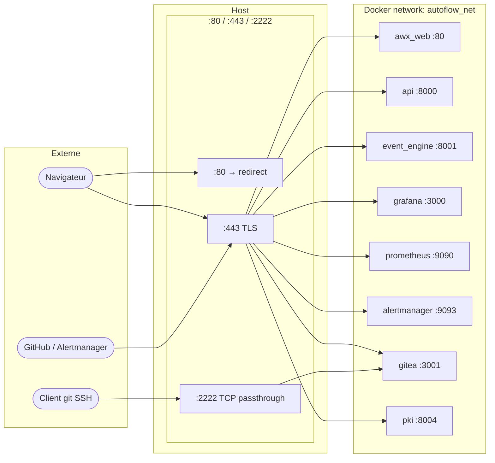

# Réseau & Traefik

Traefik est le **point d'entrée unique** de toute la stack Autoflow. Il termine TLS, route les requêtes HTTP/HTTPS vers les bons conteneurs, et expose le port SSH de Gitea en passthrough TCP. Aucun service interne n'est exposé directement sur l'hôte.

---

## Ports exposés

| Port | Protocole | Rôle |
|------|-----------|------|
| `80` | HTTP | Redirection automatique vers HTTPS (301 permanent) |
| `443` | HTTPS | Point d'entrée principal — tous les services web |
| `2222` | TCP | SSH Git (Gitea) — configurable via `GITEA_SSH_PORT` |

!!! warning "Dashboard Traefik désactivé"
    Le dashboard Traefik (`api.dashboard: false` dans `traefik/traefik.yml`) est désactivé en production. Pour l'activer temporairement en debug local, passer `insecure: true` et exposer le port `8080`.

---

## Architecture réseau



---

## Configuration statique — `traefik/traefik.yml`

```yaml
api:
  dashboard: false        # Désactivé en production

ping: {}                  # GET /ping → 200 OK (healthcheck Docker)

entryPoints:
  web:
    address: ":80"
    http:
      redirections:
        entryPoint:
          to: websecure
          scheme: https
          permanent: true   # 301 Permanent redirect

  websecure:
    address: ":443"
    transport:
      respondingTimeouts:
        readTimeout:  "600s"   # Uploads registry (blobs lourds)
        writeTimeout: "600s"
        idleTimeout:  "180s"

  gitea-ssh:
    address: ":2222"           # TCP passthrough vers Gitea

providers:
  docker:
    exposedByDefault: false    # Seuls les conteneurs avec traefik.enable=true sont routés
    network: autoflow_net
    watch: true                # Hot-reload lors de démarrage/arrêt de conteneurs

  file:
    directory: /etc/traefik/dynamic
    watch: true                # Hot-reload des fichiers de config dynamique

log:
  level: INFO

accessLog:
  format: json
  fields:
    defaultMode: keep
    headers:
      defaultMode: drop
      names:
        User-Agent: keep
        X-Forwarded-For: keep
```

### Timeouts étendus pour le registre Docker

Le registre Gitea sert des images Docker qui peuvent dépasser 2 Go (AWX EE patché). Les timeouts `readTimeout`/`writeTimeout` à 600 secondes évitent les interruptions lors de `docker push` ou `docker pull` sur des couches volumineuses.

---

## Routage par sous-domaine

Tous les services utilisent le routage par **subdomain** basé sur la variable `DOMAIN` de `.env`.

| Sous-domaine | Service interne | Port | Middlewares |
|---|---|---|---|
| `awx.DOMAIN` | `awx_web` | 80 | `secure-headers` |
| `git.DOMAIN` | `gitea` | 3001 | `gitea-proxy-headers`, `secure-headers` |
| `api.DOMAIN` | `api` | 8000 | `secure-headers` |
| `events.DOMAIN` | `event_engine` | 8001 | `secure-headers` |
| `grafana.DOMAIN` | `grafana` | 3000 | `secure-headers` |
| `prometheus.DOMAIN` | `prometheus` | 9090 | `monitoring-auth`, `secure-headers` |
| `alerts.DOMAIN` | `alertmanager` | 9093 | `monitoring-auth`, `secure-headers` |
| `pki.DOMAIN` | `pki` | 8004 | `secure-headers` |
| `scanner.DOMAIN` | `security_scanner` | 8002 | `monitoring-auth`, `secure-headers` |
| `ee.DOMAIN` | `ee_builder` | 8003 | `secure-headers` |
| `minio.DOMAIN` | `minio` console | 9001 | `monitoring-auth`, `secure-headers` |

!!! info "Labels Docker"
    Chaque service déclare ses règles Traefik via des labels Docker dans `docker-compose.yml`. Exemple pour l'API :
    ```yaml
    labels:
      - "traefik.enable=true"
      - "traefik.http.routers.api.rule=Host(`api.${DOMAIN:-localhost}`)"
      - "traefik.http.routers.api.entrypoints=websecure"
      - "traefik.http.routers.api.tls=true"
      - "traefik.http.services.api.loadbalancer.server.port=8000"
    ```

---

## Redirection HTTP → HTTPS

La redirection est déclarée au niveau de l'entrypoint `web` dans la configuration statique :

```yaml
entryPoints:
  web:
    address: ":80"
    http:
      redirections:
        entryPoint:
          to: websecure
          scheme: https
          permanent: true
```

Toute requête HTTP sur le port 80 reçoit un `301 Moved Permanently` vers l'équivalent HTTPS. Aucune configuration par-service n'est nécessaire.

---

## TLS — certificats PKI internes

### Résolution des certificats

Autoflow utilise une **PKI interne** (service `pki`) pour générer des certificats wildcard signés par une CA maison. Traefik charge ces certificats depuis `traefik/certs/`.

=== "traefik/dynamic/tls.yml"
    ```yaml
    tls:
      stores:
        default:
          defaultCertificate:
            certFile: /etc/traefik/certs/wildcard.{{ env "DOMAIN" }}.crt
            keyFile:  /etc/traefik/certs/wildcard.{{ env "DOMAIN" }}.key

      certificates:
        - certFile: /etc/traefik/certs/wildcard.{{ env "DOMAIN" }}.crt
          keyFile:  /etc/traefik/certs/wildcard.{{ env "DOMAIN" }}.key
    ```

=== "Structure traefik/certs/"
    ```
    traefik/certs/
    ├── ca.DOMAIN.crt              ← CA publique (à distribuer aux clients)
    ├── wildcard.DOMAIN.crt        ← Certificat wildcard *.DOMAIN
    └── wildcard.DOMAIN.key        ← Clé privée (chmod 600)
    ```

!!! tip "Confiance navigateur"
    Pour éviter les avertissements TLS, installez `traefik/certs/ca.DOMAIN.crt` dans le magasin de certificats de votre OS/navigateur, ou téléchargez-le depuis `https://pki.DOMAIN/ca/download`.

### Wildcard vs. Let's Encrypt

Autoflow utilise **uniquement des certificats PKI internes**. Let's Encrypt n'est pas supporté car la stack est conçue pour des déploiements intranet sans accès internet sortant. Pour une exposition publique, remplacez le bloc `tls.stores` par un `certificatesResolvers` ACME.

---

## Middlewares — `traefik/dynamic/middlewares.yml`

```yaml
http:
  middlewares:

    # En-têtes de sécurité HTTP appliqués à toutes les réponses
    secure-headers:
      headers:
        frameDeny: true
        contentTypeNosniff: true
        referrerPolicy: "strict-origin-when-cross-origin"
        stsSeconds: 31536000
        stsIncludeSubdomains: true
        stsPreload: true
        forceSTSHeader: true
        customResponseHeaders:
          X-Robots-Tag: "noindex,nofollow,nosnippet,noarchive,notranslate,noimageindex"
          Server: ""
          Permissions-Policy: "geolocation=(), camera=(), microphone=(), payment=(), usb=()"

    # BasicAuth pour Prometheus, Alertmanager, MinIO console, Security Scanner
    monitoring-auth:
      basicAuth:
        usersFile: /etc/traefik/dynamic/monitoring_users

    # Rate limiting : 100 req/s en moyenne, burst 200
    rate-limit:
      rateLimit:
        average: 100
        burst: 200

    # Headers proxy Gitea (container registry WWW-Authenticate realm)
    gitea-proxy-headers:
      headers:
        customRequestHeaders:
          X-Forwarded-Proto: "https"
```

### BasicAuth monitoring (`MONITORING_ADMIN_USER` / `MONITORING_ADMIN_PASSWORD`)

Le fichier `traefik/dynamic/monitoring_users` contient les identifiants hashés en **bcrypt** (format htpasswd). Il est généré automatiquement par le **Deploy Wizard** lors de la sauvegarde de la configuration.

Pour générer manuellement :
```bash
# Génération htpasswd bcrypt
htpasswd -nB admin
# Ou via Docker :
docker run --rm httpd:alpine htpasswd -nB admin
```

Collez le résultat dans `traefik/dynamic/monitoring_users`. Traefik recharge le fichier automatiquement (provider `file` en mode `watch`).

---

## Header X-Forwarded-Proto pour AWX/Django

AWX (Django) se trouve derrière Traefik qui termine TLS. Pour que Django sache que la connexion est HTTPS (cookies `Secure`, CSRF), Traefik **injecte** le header `X-Forwarded-Proto: https` via le middleware `gitea-proxy-headers`, et AWX est configuré avec :

```python
# awx/settings.py
SECURE_PROXY_SSL_HEADER = ('HTTP_X_FORWARDED_PROTO', 'https')
USE_X_FORWARDED_HOST    = True
CSRF_COOKIE_SECURE      = True
SESSION_COOKIE_SECURE   = True
```

!!! danger "Ne jamais supprimer ce header"
    Sans `X-Forwarded-Proto: https`, AWX génère des tokens CSRF invalides et les cookies de session ne sont pas transmis, ce qui rend l'interface inaccessible.

---

## Réseau Docker `autoflow_net`

Tous les services Autoflow sont connectés au réseau bridge `autoflow_net` (défini dans `docker-compose.yml` comme `name: autoflow_net`). **Aucun service** n'expose directement de port sur l'hôte à l'exception de Traefik.

```yaml
# docker-compose.yml
networks:
  autoflow:
    driver: bridge
    name: autoflow_net
```

La communication inter-services utilise les noms de conteneurs comme hostnames (`postgres`, `redis`, `awx_web`, `gitea`, etc.).

!!! info "Isolation"
    Un attaquant ayant accès réseau à la machine hôte ne peut pas joindre directement `postgres:5432` ou `redis:6379` car ces ports ne sont pas publishés. Seul Traefik sur `:80`, `:443` et `:2222` est accessible depuis l'extérieur.

---

## SSH Git — `GITEA_SSH_PORT`

Gitea expose un serveur SSH pour les opérations `git clone`/`push` via SSH. Traefik redirige le port `2222` de l'hôte vers le port SSH interne de Gitea via un **TCP router** :

```yaml
# Dans docker-compose.yml (labels Gitea)
- "traefik.tcp.routers.gitea-ssh.rule=HostSNI(`*`)"
- "traefik.tcp.routers.gitea-ssh.entrypoints=gitea-ssh"
- "traefik.tcp.services.gitea-ssh.loadbalancer.server.port=22"
```

**Clonage via SSH :**
```bash
git clone ssh://git@git.DOMAIN:2222/user/repo.git
# ou avec la syntaxe courte si GITEA_SSH_PORT=2222 est configuré dans ~/.ssh/config :
git clone git@git.DOMAIN:user/repo.git
```

Exemple de configuration `~/.ssh/config` :
```
Host git.DOMAIN
    Port 2222
    User git
    IdentityFile ~/.ssh/id_ed25519
```

---

## Ajouter un nouveau sous-domaine

Pour exposer un nouveau service via Traefik, ajoutez les labels suivants au service dans `docker-compose.yml` :

```yaml
services:
  mon-service:
    image: mon-image:latest
    networks:
      - autoflow
    labels:
      - "traefik.enable=true"
      # Règle de routage par hostname
      - "traefik.http.routers.mon-service.rule=Host(`mon-service.${DOMAIN:-localhost}`)"
      # Entrypoint HTTPS uniquement
      - "traefik.http.routers.mon-service.entrypoints=websecure"
      # Activation TLS
      - "traefik.http.routers.mon-service.tls=true"
      # Middlewares (optionnel)
      - "traefik.http.routers.mon-service.middlewares=secure-headers@file"
      # Port interne du service
      - "traefik.http.services.mon-service.loadbalancer.server.port=8080"
```

!!! tip "Pas de redémarrage Traefik"
    Le provider Docker est en mode `watch: true`. Traefik détecte automatiquement les nouveaux conteneurs avec `traefik.enable=true` et met à jour sa configuration sans redémarrage.

### Ajouter une protection BasicAuth

Pour protéger le nouveau service avec le même mécanisme que Prometheus/Alertmanager :

```yaml
labels:
  # ...
  - "traefik.http.routers.mon-service.middlewares=monitoring-auth@file,secure-headers@file"
```

Les identifiants sont ceux de `MONITORING_ADMIN_USER` / `MONITORING_ADMIN_PASSWORD`.

---

## Référence rapide

```bash
# Vérifier la configuration Traefik (depuis le conteneur)
docker exec autoflow_traefik traefik healthcheck --ping

# Voir les logs Traefik en temps réel
make logs SERVICES=traefik

# Forcer le rechargement de la configuration dynamique
# (automatique avec watch: true — utile si le rechargement ne se fait pas)
docker exec autoflow_traefik kill -HUP 1

# Vérifier le certificat servi
openssl s_client -connect awx.DOMAIN:443 -servername awx.DOMAIN < /dev/null 2>/dev/null \
  | openssl x509 -noout -dates -subject
```
