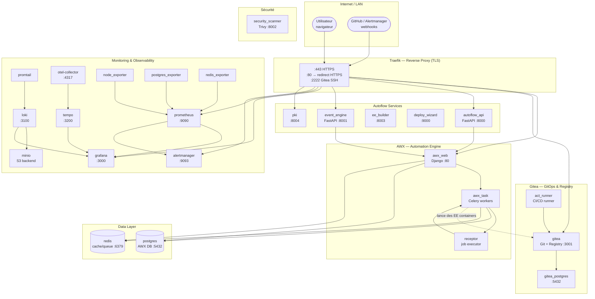
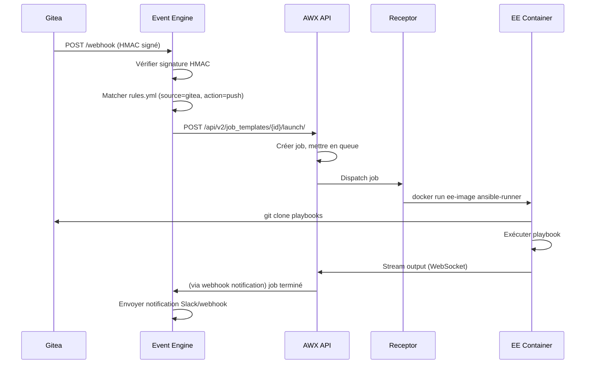
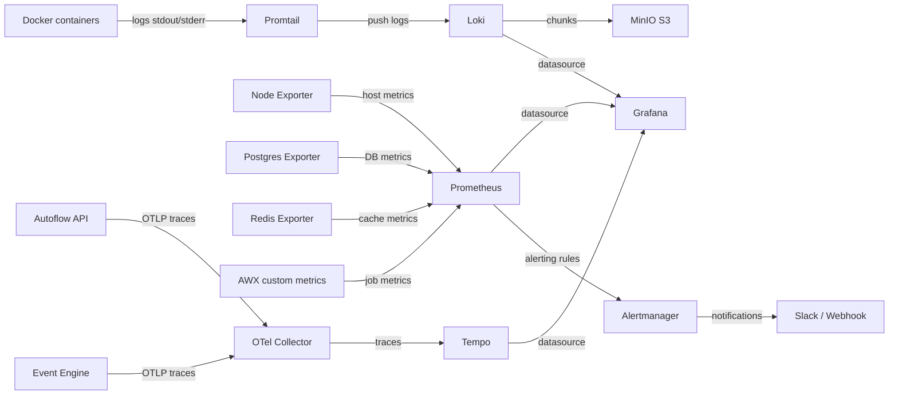

# Architecture

## Vue d'ensemble

Autoflow est une stack **docker-compose single-node** organisée en couches fonctionnelles. Tout le trafic entrant passe par Traefik qui termine TLS et route vers le bon service interne.



---

## Couches fonctionnelles

### 1. Couche réseau — Traefik

Traefik est le **seul point d'entrée** de la stack. Il :

- Termine TLS avec les certificats générés par la PKI interne
- Redirige HTTP → HTTPS automatiquement
- Route chaque sous-domaine vers le bon conteneur Docker (`awx.*` → awx_web, `git.*` → gitea, etc.)
- Injecte `X-Forwarded-Proto: https` pour que Django/AWX active les cookies Secure
- Protège Prometheus et Alertmanager avec BasicAuth

**Ports exposés sur l'hôte :**

| Port | Protocole | Usage |
|------|-----------|-------|
| 80 | TCP | HTTP → redirect HTTPS |
| 443 | TCP | HTTPS (tout le trafic) |
| 2222 | TCP | Git SSH (Gitea) |

Tous les autres ports restent **internes au réseau Docker** `autoflow_net`.

---

### 2. Couche automation — AWX

AWX est décomposé en **trois conteneurs** qui collaborent :

| Conteneur | Rôle | Technologie |
|---|---|---|
| `awx_web` | Interface HTTP + API REST | Django + nginx + uWSGI |
| `awx_task` | Workers asynchrones (jobs, inventaires, projets) | Celery |
| `receptor` | Exécuteur de jobs, communication avec les EE | Receptor mesh |

Le conteneur `awx_migrate` est un job d'initialisation qui applique les migrations Django puis s'arrête.

**Flux d'exécution d'un job :**

```
awx_web (API)
  → awx_task (Celery: pick up job)
    → receptor (spawn EE container via Docker socket)
      → EE container (run playbook)
        → Gitea (clone project)
        → Target hosts (SSH)
      → awx_task (collect output, update job status)
    → awx_web (WebSocket: stream output to UI)
```

Les **Execution Environments (EE)** sont des images Docker contenant :
- ansible-core
- les collections Ansible nécessaires
- les dépendances Python et système

Elles sont buildées par `ee_builder` et stockées dans le registry Gitea.

---

### 3. Couche GitOps — Gitea

Gitea remplace GitHub/GitLab pour héberger :

- **Les playbooks Ansible** (projets AWX pointent sur Gitea)
- **Les Execution Environments** (registry OCI intégré)
- **Les workflows CI/CD** (Gitea Actions, compatible GitHub Actions)

`act_runner` est le runner CI/CD qui exécute les workflows Gitea Actions dans des conteneurs Docker.

Gitea dispose de sa **propre instance PostgreSQL** isolée de celle d'AWX.

---

### 4. Couche données

| Service | Backend | Volume Docker | Usage |
|---|---|---|---|
| `postgres` | PostgreSQL 15 | `postgres_data` | AWX : jobs, inventaires, credentials, config |
| `gitea_postgres` | PostgreSQL 15 | `gitea_postgres_data` | Gitea : repos, users, webhooks |
| `redis` | Redis 7 | `redis_data` | AWX : cache de session, queue Celery, channels |
| `minio` | MinIO | `minio_data` | Loki : stockage des chunks de logs |

!!! success "Volumes critiques protégés"
    Les volumes critiques (PostgreSQL AWX, PostgreSQL Gitea, Redis, Gitea, PKI) sont déclarés **`external: true`** dans `docker-compose.yml`. Docker Compose ne les gère pas — `docker compose down -v` ne peut **pas** les supprimer.

    Ils sont créés automatiquement :

    - **Via le wizard** — à l'étape "Save & Deploy" (et `autoflow_pki_data` dès l'étape PKI)
    - **Via le Makefile** — `make start` les crée avant `docker compose up`

    Les volumes non-critiques (Prometheus, Grafana, Loki, Tempo, MinIO, Trivy DB) restent gérés par Compose et peuvent être recréés sans perte de données métier.

---

### 5. Couche observabilité — LGTM Stack

Autoflow embarque la stack **LGTM** complète (Loki, Grafana, Tempo, Mimir/Prometheus) :

```
Logs    → Promtail → Loki → MinIO (stockage) → Grafana (visualisation)
Métriques → Node/PG/Redis Exporters → Prometheus → Grafana
Traces  → OTel Collector → Tempo → Grafana
Alertes → Prometheus → Alertmanager → Slack/Webhook
```

**Promtail** scrape les logs de **tous les conteneurs Docker** en lisant `/var/lib/docker/containers`. Il étiquette chaque ligne de log avec le nom du conteneur, l'image et le compose project.

---

### 6. Couche sécurité

| Service | Rôle |
|---|---|
| `pki` | Autorité de certification interne (CA root + intermédiaire) |
| `security_scanner` | Scanner Trivy : CVE sur images Docker + rapports de conformité |
| Traefik middlewares | BasicAuth pour monitoring, HTTPS forcé, headers sécurité |
| SOPS + Age | Chiffrement du fichier `.env` au repos |

---

## Réseau Docker

Tous les services partagent le réseau Docker `autoflow_net` (bridge). Aucun port interne n'est exposé sur `0.0.0.0` — uniquement via Traefik.

```
autoflow_net (172.20.0.0/16)
├── traefik        (seul point d'entrée depuis l'extérieur)
├── awx_web
├── awx_task
├── receptor
├── postgres
├── redis
├── gitea
├── gitea_postgres
├── api
├── event_engine
├── prometheus
├── grafana
├── loki
├── minio
├── tempo
├── alertmanager
├── promtail
├── otel_collector
├── pki
├── security_scanner
├── ee_builder
└── act_runner
```

---

## Flux de données — Webhook vers job AWX

Scénario : un push sur la branche `main` de Gitea déclenche un déploiement.



---

## Flux de données — Monitoring


